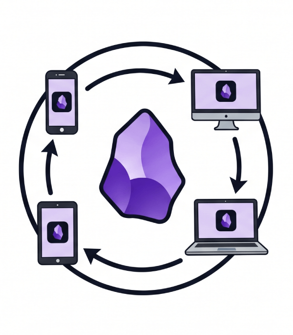

<p align="center">
  
</p>

# obsidian-sync

A self-hosted replacement for Obsidian's paid Sync service: an Obsidian plugin (desktop, iOS, Android) plus a synchronisation server, with end-to-end encryption, full-vault coverage, version history, and near-real-time propagation.

The server stores ciphertext and never holds a key. It cannot read your notes, their names, or your folder structure.

> **Status:** early. The protocol, server, crypto, and sync engine are implemented and tested; several plugin surfaces described in the design are not yet built — see [Not yet implemented](#not-yet-implemented).

---

## Features

### Sync

| | |
|---|---|
| **Whole-vault coverage** | Markdown, attachments, and `.obsidian` configuration — themes, snippets, and other plugins' `data.json`. |
| **Any number of devices** | Desktop (Windows, macOS, Linux), iOS, and Android from one plugin build. |
| **Near-real-time** | A WebSocket push channel over `https://`, a held-open long-poll over `http://`, and fixed-interval polling as an always-available fallback. The channel carries only sequence numbers, so switching between them is invisible to the sync engine. |
| **Offline-correct** | Edit on a plane, land, and converge. The cursor advances only after a batch is applied, so a crash replays rather than skips, and a delete that never reached the server is recovered by reconciling the index against the vault. |
| **Selective sync** | Per-device toggles for markdown, attachments, vault configuration, themes, snippets, and plugin settings; a comma-separated folder exclusion list; and a maximum file size above which files are skipped. Changes apply to a running sync without a restart. |
| **Version history** | Every commit is a version, retained by age (default 90 days) and by a per-file minimum (default 10) regardless of age. |

### Encryption

| | |
|---|---|
| **End-to-end** | The server stores ciphertext and never holds a key. Your passphrase is never transmitted. |
| **Encrypted paths** | File names and folder structure are encrypted too. The server keys its records by `HMAC(K_name, path)` and cannot invert it. |
| **AES-256-GCM content** | Under a key derived from your passphrase via PBKDF2-SHA-512 (650,000 iterations) and HKDF-SHA-256. |
| **Tamper-evident** | The ordered chunk list is authenticated inside the metadata envelope and re-verified on pull, so a server that reorders, drops, or splices a chunk is detected by the client rather than surfacing as corrupt notes. |

### Conflicts

| | |
|---|---|
| **Three-way merge** | Two devices editing different parts of the same note both keep their edits, merged against a cached common ancestor. Obsidian's own Sync uses last-write-wins. |
| **Nothing is destroyed** | An unmergeable edit is copied out as `note (conflict YYYY-MM-DD HH-mm-ss).md` before the remote version takes the file. A remote delete never beats a local edit. |
| **Server never merges** | It cannot read the bytes. A stale commit is rejected with `409`; the client pulls, merges locally, and retries. |

### Storage and operations

| | |
|---|---|
| **Chunked and deduplicated** | Files are split into 4 MiB chunks addressed by content, so editing one word in a 40 MB PDF uploads one chunk and version history shares everything unchanged. |
| **Cheap renames** | Chunks are reused verbatim; nothing is re-uploaded. |
| **One small container** | `gcr.io/distroless/nodejs26-debian13:nonroot` — no shell, no package manager, non-root, `amd64` and `arm64`. Storage is `node:sqlite`, built into Node, so there are no native modules to compile. |
| **No accounts** | Users are bearer tokens in environment variables. No registration, no password reset, no session state. |

### Non-goals

Live collaborative editing (this is not a CRDT — sync converges after edits settle), multi-tenant SaaS, server-side search or a web UI (end-to-end encryption forecloses all three), and horizontal scale-out.

---

## Installation

Two halves: a server you run once, and a plugin you install into each vault. Both are needed.

### 1. Run the server

The server is a single process. Running two replicas against one SQLite file would corrupt it.

First, generate a token for each user — at least 32 characters, or startup fails:

```bash
openssl rand -hex 32
```

#### Docker Compose (recommended)

```bash
curl -O https://raw.githubusercontent.com/avbel/obsidian-sync/main/compose.yaml
echo "SYNC_USER_ALICE=$(openssl rand -hex 32)" > .env
docker compose up -d
docker compose logs -f sync
```

Your token is now in `.env`; you will paste it into the plugin. Add more users by adding more `SYNC_USER_<NAME>` variables to the `environment:` block.

#### Docker

```bash
docker volume create obsidian-sync-data
docker run -d --name obsidian-sync \
  --restart unless-stopped \
  -p 3000:3000 \
  -v obsidian-sync-data:/data \
  -e SYNC_USER_ALICE="$(openssl rand -hex 32)" \
  ghcr.io/avbel/obsidian-sync-server:latest
```

| Tag | Tracks |
|---|---|
| `latest` | The newest release. |
| `0.0.9`, `0.0` | A specific release. |
| `main` | Every push to the default branch. |
| `sha-<short>` | A specific commit. |

#### From source

Requires Node.js 26+ and pnpm.

```bash
git clone https://github.com/avbel/obsidian-sync.git
cd obsidian-sync
pnpm install
pnpm build
SYNC_USER_ALICE=<token> DATA_DIR=./data node packages/server/dist/index.js
```

#### Check it is up

```bash
curl http://localhost:3000/v1/health
curl -H "Authorization: Bearer <token>" http://localhost:3000/v1/me
```

#### Reaching it from your devices

Put the server on a [Tailscale](https://tailscale.com) tailnet rather than the public internet, and use its tailnet address (`http://100.x.y.z:3000`) as the server URL. The tokens are pre-shared and there is no rate limiting or account recovery by design — the tailnet is the outer perimeter and the token is the inner one.

Over plain `http://` the plugin uses long-poll, because a mobile WebView blocks `ws://` to a tailnet address. Over `https://` — behind a reverse proxy with a real certificate, or via Tailscale Serve — it upgrades to a WebSocket and falls back to long-poll on failure. Both are correct; `https://` is just faster to notice a change.

Back up `/data` (or the named volume). It holds the SQLite database and every encrypted chunk.

### 2. Install the plugin

Requires Obsidian **1.13.2** or newer. There is no community-plugin listing yet.

#### From a release

1. Download `main.js`, `manifest.json`, and `styles.css` from the [latest release](https://github.com/avbel/obsidian-sync/releases/latest).
2. Create `<vault>/.obsidian/plugins/obsidian-sync/` and put all three files in it.
3. Reload Obsidian and enable **Obsidian Sync** under Settings → Community plugins.

#### Via BRAT

Install [BRAT](https://github.com/TfTHacker/obsidian42-brat), then **Add beta plugin** with `avbel/obsidian-sync`. It keeps the plugin updated for you.

#### From source

```bash
git clone https://github.com/avbel/obsidian-sync.git
cd obsidian-sync
pnpm install
pnpm --filter @obsidian-sync/protocol build
pnpm --filter @obsidian-sync/plugin build

mkdir -p <vault>/.obsidian/plugins/obsidian-sync
cp packages/plugin/{main.js,manifest.json,styles.css} \
   <vault>/.obsidian/plugins/obsidian-sync/
```

On iOS and Android the plugin folder lives inside the vault, so the easiest route is to install on a desktop vault first and let the files reach the phone, or use a file manager that can see the vault directory.

### 3. Connect the first device

In Settings → Obsidian Sync:

1. **Server URL** — `http://100.x.y.z:3000`, your tailnet address.
2. **Auth token** — the value of `SYNC_USER_ALICE`. Press **Test**; it should report your username and vault count.
3. **Vault name** — defaults to `default`. It is created on the server on first sync.
4. **Passphrase** — this encrypts everything. Choose it carefully; see the warning below.
5. **Device label** — prefilled from the machine name; it only names this device in version history.
6. **Enable sync**.

The token and passphrase go into Obsidian's `secretStorage`, never into `data.json` — that file lives inside the vault and would itself be synced.

> **Your passphrase is not recoverable.** It never reaches the server, so nobody can reset it. Losing it means losing the remote copy of the vault. Record it somewhere safe before you sync anything you care about.

### 4. Add more devices

Install the plugin in the new vault and enter the **same server URL, token, vault name, and passphrase**. A different passphrase produces a vault the other devices cannot decrypt. The first sync downloads everything; after that only changes move.

---

## How it works

```
┌────────────┐   nudge (seq only)   ┌──────────────┐
│  Plugin    │◄─────────────────────│   Server     │
│  (device)  │                      │  Node 26     │
│            │  encrypted chunks    │  node:sqlite │
│  crypto    │─────────────────────►│  blob store  │
│  engine    │  + version commits   │              │
└────────────┘                      └──────────────┘
```

**Identity.** `fileId = HMAC-SHA-256(K_name, normalised_path)`. Deterministic, so every device derives the same identifier for the same path with no coordination, and the server keys its records without ever learning a path. Paths are normalised to NFC — macOS and iOS hand back decomposed filenames while Linux and Android do not, and without normalising the same note would sync as two files.

**Keys.** Passphrase → PBKDF2-SHA-512, 650,000 iterations, per-vault 16-byte salt → HKDF-SHA-256 → `K_content`, `K_path`, `K_name`. The salt is stored server-side and is not secret; the passphrase is never transmitted.

**Content.** Files are split into 4 MiB chunks, each encrypted with AES-256-GCM under `K_content`. Both the chunk's address and its nonce are derived from the plaintext:

```
blobAddress = HMAC-SHA-256(K_content, 0x01 ‖ chunk)
nonce       = HMAC-SHA-256(K_content, 0x02 ‖ chunk)[0:12]
```

A stored blob is therefore a pure function of its content, which is what makes deduplication, chunk sharing across versions, and the `blobs/check` upload optimisation work — while remaining uncomputable to a server that lacks `K_content`. Position integrity lives one layer up: the ordered chunk list is inside the encrypted metadata envelope, authenticated with `AAD = fileId`, and the client recomputes every address on pull. A server that reorders, drops, or splices a chunk is detected by the client.

**Concurrency.** A commit names the version the client believes is current. If it is no longer the head, the server replies `409` and commits nothing. The server never merges — it cannot read the bytes — so it rejects, and the client pulls, merges locally, and retries. `409` is normal control flow, not an error.

**What the server learns.** The number of files in a vault, each file's size rounded to chunk granularity, when uploads happen and from which device, and the shape of the version graph. Not file names, folder structure, tags, or content.

Full rationale, including the decisions and their trade-offs, is in [`docs/specs/2026-09-10-obsidian-sync-design.md`](docs/specs/2026-09-10-obsidian-sync-design.md).

---

## Repository layout

| Package | Contents |
|---|---|
| `packages/protocol` | Wire types, validators, envelope format, path normalisation, shared constants. |
| `packages/server` | Fastify server, SQLite schema, blob store, change log, retention, Dockerfile. |
| `packages/plugin` | Obsidian plugin: crypto, transport, sync engine, three-way merge, UI. |

---

## Server reference

### Configuration

| Variable | Default | Meaning |
|---|---|---|
| `PORT` | `3000` | Listen port |
| `HOST` | `0.0.0.0` | Listen address |
| `DATA_DIR` | `/data` | SQLite file and blob store root |
| `SYNC_USER_<NAME>` | — | Defines a user and their bearer token |
| `MAX_BLOB_BYTES` | `8388608` | Upload size ceiling per chunk |
| `LONGPOLL_MAX_WAIT_MS` | `25000` | Server-side hold ceiling |
| `VERSION_RETENTION_DAYS` | `90` | Age at which old versions become pruneable |
| `VERSION_RETENTION_MIN` | `10` | Versions per file always kept regardless of age |
| `ORPHAN_BLOB_GRACE_MS` | `86400000` | Age before an unreferenced blob may be reclaimed |
| `LOG_LEVEL` | `info` | pino level |

Users are defined entirely by environment: `SYNC_USER_ALICE=<token>` creates the user `alice`. Startup fails loudly on a duplicate token, a case-colliding username, or a token shorter than 32 characters.

### API

All routes require `Authorization: Bearer <token>` except health.

| Method | Path | Purpose |
|---|---|---|
| `GET` | `/v1/health` | Liveness. No auth. |
| `GET` | `/v1/me` | Resolves a token to `{ user, vaults[] }`. |
| `POST` | `/v1/vaults` | Create a remote vault with a KDF salt. |
| `GET` | `/v1/vaults/:v/changes?since=N&wait=25` | Long-poll for changes past a cursor. |
| `POST` | `/v1/vaults/:v/blobs/check` | Given addresses, returns which are absent. |
| `PUT` | `/v1/vaults/:v/blobs/:addr` | Idempotent chunk upload. |
| `GET` | `/v1/vaults/:v/blobs/:addr` | Fetch a chunk. |
| `POST` | `/v1/vaults/:v/files/:fileId` | Commit a version. |
| `DELETE` | `/v1/vaults/:v/files/:fileId` | Tombstone a file. |
| `GET` | `/v1/vaults/:v/files/:fileId/versions` | Version history. |
| `GET` | `/v1/vaults/:v/state` | Full file list with head versions, for reconcile. |
| `WS` | `/v1/vaults/:v/stream` | Optional push channel. Carries `seq` nudges only. |

---

## Conflict handling

| Situation | Resolution |
|---|---|
| Local unchanged since the last sync | Remote is written directly. |
| Local changed, text file, ancestor known | Three-way merge. Clean → merged and pushed. Conflicted → remote takes the file, local is saved as `note (conflict YYYY-MM-DD HH-mm-ss).md`. |
| Identical bytes on both sides | Adopted silently. Matching content is never a conflict. |
| Local changed, no ancestor | Conflict copy. Merging without an ancestor invents changes. |
| Binary file | Conflict copy always. |
| Deleted remotely, modified locally | Local wins and is pushed as a new version. Deletion never beats an edit. |
| Renamed on both sides | Both survive; you reconcile. Identity follows the path, so a rename is a delete plus a create. |

No path through that table destroys data without an explicit choice.

## What is never synced

- `workspace.json` and `workspace-mobile.json` — they describe device-local pane layout.
- This plugin's own state directory.
- Obsidian's local trash (`.trash/`), which would otherwise resurrect every deleted note on every other device, and version-control metadata (`.git/`, `.svn/`, `.hg/`).
- Operating-system debris: `.DS_Store`, `._*` resource forks, `.Spotlight-V100/`, `Thumbs.db` (and `Thumbs.db:encryptable`), `ehthumbs.db`, `desktop.ini`, `$RECYCLE.BIN/` and friends. Matching is case-insensitive, because macOS and Windows are.
- Editor, log and download temporaries: `*.swp`, `*~`, `*.~*`, `.#*`, `~$*`, `*.tmp`, `*.log`, `*.bak`, `*.old`, `*.part`, `*.crdownload`.

---

## Development

Requires Node.js 26+ and pnpm.

```bash
pnpm install
pnpm test        # vitest, all packages
pnpm typecheck   # tsc --noEmit, all packages
pnpm lint        # biome
pnpm build       # protocol + server (tsc), plugin (esbuild bundle)
```

To iterate on the plugin against a real vault, symlink `packages/plugin` into `<vault>/.obsidian/plugins/obsidian-sync/` and run `node packages/plugin/esbuild.config.mjs` for a watching build.

The container image carries no toolchain: CI runs `pnpm deploy --filter @obsidian-sync/server --prod out` on the runner and the Dockerfile only copies `out/` into distroless. `docker build` therefore needs that directory to exist first:

```bash
pnpm install
pnpm --filter @obsidian-sync/protocol build
pnpm --filter @obsidian-sync/server build
pnpm deploy --filter @obsidian-sync/server --prod out
docker build -f packages/server/Dockerfile -t obsidian-sync-server .
```

The highest-value suite is `packages/plugin/src/engine/engine.test.ts`: two in-process virtual devices driving one in-memory model of the server through concurrent edits, merges, conflicts, deletes, and reconnects. Sync bugs live in races, not in units.

---

## Not yet implemented

The design describes more than is built. Currently missing:

- First-run setup wizard, and the *Verify passphrase* action.
- Version history and restore UI (the server API exists; the plugin does not call it).
- Conflict resolution modal — conflicts produce a copy and a notice, but no interactive resolve.
- Full reconcile against `GET /state`. The *Full reconcile* command currently runs an ordinary incremental sync.
- Durable, restart-surviving offline queue. Pending deletes are held in memory; a lost delete is recovered on the next sync by reconciling the index against the vault, so correctness holds, but the queue itself is not persisted.
- A real foreground hook on mobile. iOS suspends a backgrounded app, freezing any request in flight; sync resumes on the next trigger, but `active-leaf-change` is a proxy for foregrounding rather than the event itself.

---

## Licence

[MIT](LICENSE).
